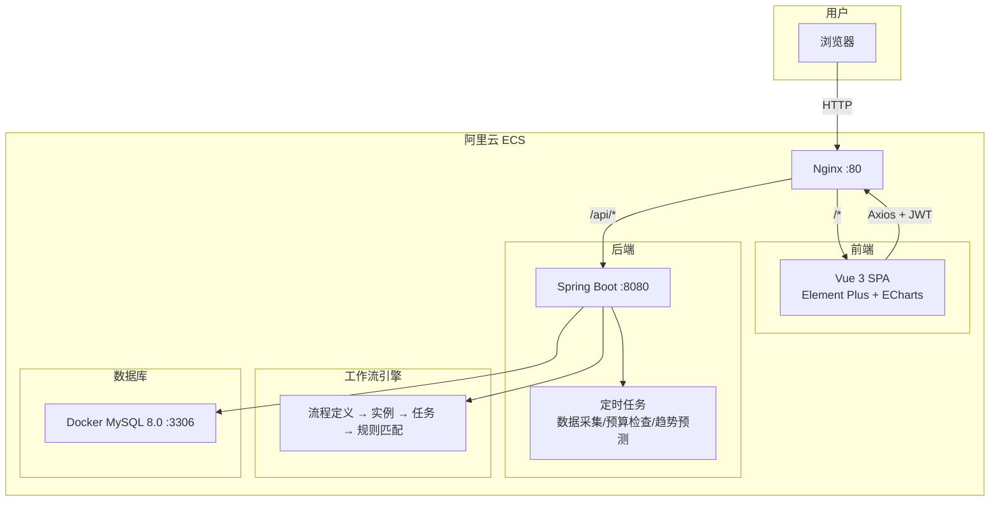
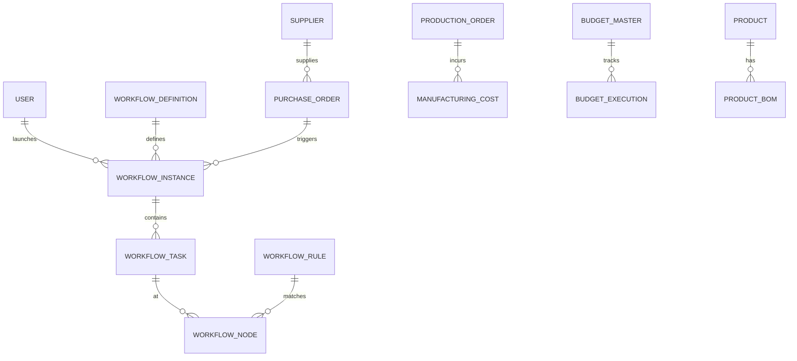

# 业财一体化管理系统 — 智能制造内控平台

覆盖制造企业采购、生产、成本、预算、内控五大业务域的财务业务一体化管理系统，内建轻量级工作流引擎。

## 演示

> 在线地址：http://8.156.38.68  
> 测试账号：`admin` / `123456`

## 技术栈

| 层级 | 技术 |
|------|------|
| 前端 | Vue 3 + Element Plus + ECharts + Pinia + Vite |
| 后端 | Spring Boot 3.1 + MyBatis Plus + JWT + Knife4j |
| 数据库 | MySQL 8.0 + H2（测试） |
| 定时任务 | Spring @Scheduled |
| 部署 | 阿里云 ECS + Nginx + Docker + Systemd |

## 系统架构



## 数据库 ER 图（核心表）



## 项目结构

```
├── backend/                              # Spring Boot 后端
│   └── src/main/java/com/example/finance/
│       ├── controller/                   # REST 控制器（26 个）
│       ├── service/                      # 业务服务（24 接口 + 22 实现）
│       ├── mapper/                       # MyBatis Mapper（25 个）
│       ├── entity/                       # 实体类（26 张表）
│       ├── dto/                          # 数据传输对象
│       ├── config/                       # 配置（JWT、Knife4j、MyBatis Plus）
│       ├── task/                         # 定时任务（3 个）
│       └── common/                       # 公共基类
│
├── frontend/                             # Vue 3 前端
│   └── src/
│       ├── views/                        # 页面（12 个路由）
│       │   ├── DataVisualization.vue     # 数据可视化仪表盘
│       │   ├── CostAnalysis.vue          # 成本分析
│       │   ├── BudgetExecution.vue       # 预算执行
│       │   ├── ProductionMonitor.vue     # 生产监控
│       │   ├── InternalControl.vue       # 内控预警
│       │   └── workflow/                 # 工作流模块（7 个页面）
│       ├── api/                          # API 封装（6 个文件）
│       ├── router/                       # 路由（含 JWT 守卫）
│       ├── store/                        # Pinia 状态管理
│       └── utils/                        # Axios 拦截器 + Token 刷新
│
├── deploy/                               # 生产部署
│   ├── setup.sh                          # 阿里云一键部署脚本
│   ├── application-prod.yml              # 生产配置
│   └── init_db.sql                       # 数据库初始化
│
├── sql-scripts/                          # SQL 脚本（60+ 个）
└── docs/                                 # 项目文档
```

## 功能模块

### 数据分析（5 大核心页面）

| 模块 | 功能 |
|------|------|
| **数据可视化** | 仪表盘总览，成本/利润/预算执行率实时汇总 |
| **成本分析** | 成本趋势图、成本结构分布、材料价格走势 |
| **预算执行** | 预算执行列表、差异分析、按部门/项目汇总 |
| **生产监控** | 生产订单进度、产量追踪、制造成本核算 |
| **内控预警** | 预警日志、按类型/状态筛选、处理状态跟踪 |

### 工作流引擎（自研轻量级）

```
流程定义 → 流程实例 → 流程任务 → 审批节点
                              → 审批规则（金额阈值自动路由）
```

- **流程定义管理** — 定义审批模板和节点
- **采购申请** — 新建采购申请并启动流程
- **待办任务** — 查看和处理待审批任务
- **流程历史** — 所有流程实例的完整追踪
- **审批规则** — 按金额/部门等条件自动匹配审批人

### 定时任务

| 任务 | 频率 | 说明 |
|------|------|------|
| 数据采集 | 每 30 分钟 | 统计订单数量和金额 |
| 预算检查 | 每 15 分钟 | 检测超预算项目并生成预警 |
| 趋势预测 | 每天凌晨 2 点 | 环比分析，生成下月预测 |

### 基础功能
- JWT 登录认证 + Token 自动刷新
- Knife4j API 文档（Swagger）
- 统一响应格式 + 全局异常处理
- Excel 导入导出（Apache POI）

## 本地开发

```bash
# 启动 MySQL（Docker）
docker run -d --name mysql -p 3306:3306 \
  -e MYSQL_ROOT_PASSWORD=root \
  -e MYSQL_DATABASE=shuju \
  mysql:8.0

# 后端
cd backend
mvn spring-boot:run
# 启动在 http://localhost:8080
# API 文档：http://localhost:8080/doc.html

# 前端
cd frontend
npm install
npm run dev
# 启动在 http://localhost:3000
```

## 生产部署

```bash
# 阿里云 ECS 一键部署
cd deploy
chmod +x setup.sh
./setup.sh
```

部署脚本自动完成：Java 环境检查 → MySQL 初始化 → JAR 启动 → Nginx 配置 → 防火墙设置。
